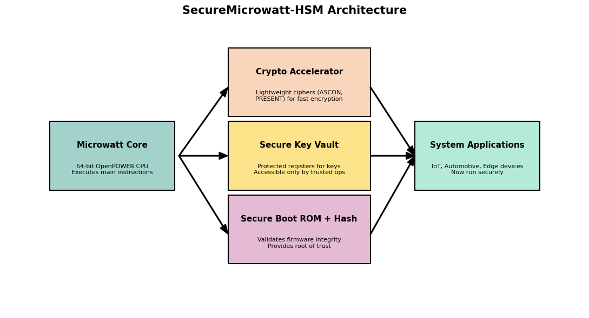
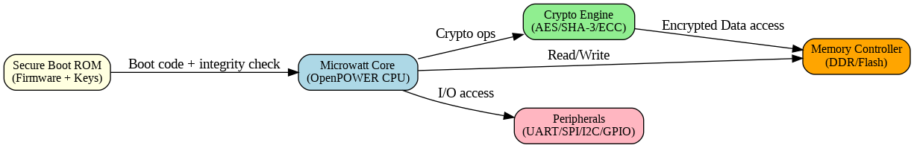
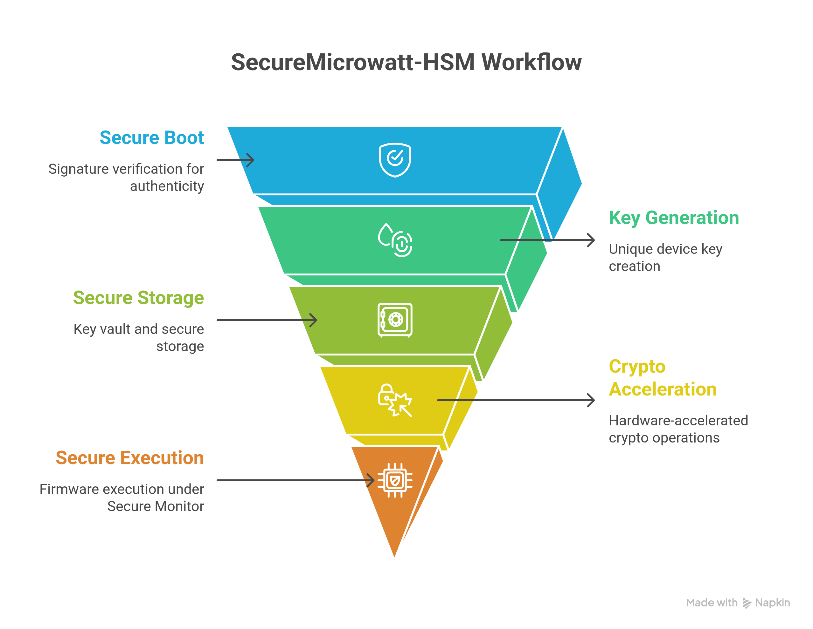
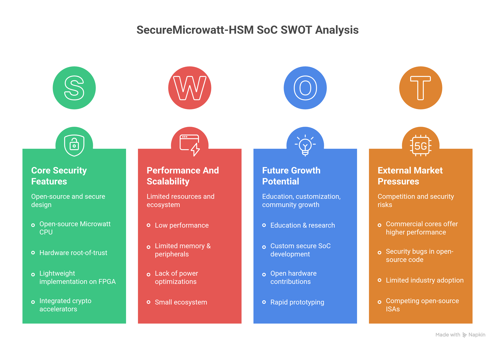

# 🔐 SecureMicrowatt-HSM  
*A Lightweight Cryptographic Extension for the Microwatt Core*  

  
  
  

  

---

## ⚡ Background  

With IoT, automotive, and edge devices proliferating worldwide, **hardware security** has become critical.  
Software-only cryptography is prone to **side-channel attacks** and tampering.  

🔴 Enterprise HSMs exist, but they are **costly & power-hungry**, unsuitable for lightweight processors.  
⚪ Microwatt (open-source Power ISA core) lacks built-in **security features** like encryption accelerators, secure boot, or tamper protection.  

---

## 🛠️ Proposed Solution – **SecureMicrowatt-HSM**  

SecureMicrowatt-HSM extends the **Microwatt core** with domain-specific security features:  

- 🔑 **PUF-Based Key Derivation** (unique per-chip identity, no NVM required)  
- 🔒 **NIST-Compliant Cryptographic Accelerators** (ASCON, PRESENT, AES, SHA)  
- 🛡️ **Secure Boot** with firmware verification  
- 🚨 **Tamper Detection & Zeroization**  
- ⚙️ **Power ISA Security Extensions**  

---

## ✨ Key Features  

- SRAM/Ring-Oscillator PUF for device identity  
- Hardware crypto engines: **ASCON AEAD, PRESENT, AES-128/256, SHA-256**  
- Secure key vault with privilege-based access control  
- Secure boot: firmware hash chain, anti-rollback counters  
- Voltage/tamper detection with instant zeroization  
- Battery-backed secure key storage  
- Custom instructions for accelerated cryptography  

---

## 🏗️ Architecture Overview  

 

   

   

## 📊 Process Flow  

   

---

## 🚀 Real-World Applications  

- 🌐 **IoT Devices** → Root-of-trust, secure firmware updates  
- 🖧 **Edge Computing** → Lightweight HSM for authentication & encryption  
- 🚗 **Automotive Systems** → ECU security & secure boot  
- 🏥 **Critical Infrastructure** → Smart grid, medical device protection  

---

## 🧮 SWOT Analysis

   

## 📊 Performance Targets  

| Component      | Throughput       | Area (LEs) | Power     |
|----------------|-----------------|------------|-----------|
| **ASCON AEAD** | 1 Gbps @ 100MHz | ~2,000     | Low       |
| **PRESENT**    | 200 MHz         | ~1,200     | Ultra-low |
| **AES-256**    | 10 Gbps         | ~3,500     | Medium    |
| **Key Vault**  | 4KB storage     | ~800       | Battery-backed |  

---

## 🛡️ Security Features  

- Target: **FIPS 140-2 Level 2**  
- Side-channel resistant (ASCON design)  
- Secure key hierarchy with privilege separation  
- Tamper evidence & rapid key zeroization  
- Cryptographic agility for future updates  

---

## 🚦 Getting Started  

### 🔧 Prerequisites  
- Xilinx Vivado / Intel Quartus (for FPGA)  
- PowerPC or RISC-V cross-compiler  
- Python 3.8+ (for test vector verification)  

